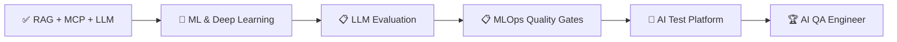

<!-- PROFILE README for firdausaslamtm -->
<h1 align="center">Hi 👋, I'm Ahmad Firdaus Aslam</h1>
<h3 align="center">QA Engineer · Building AI Systems & AI Quality · Hands-on AI Engineering</h3>

  
  
  

---

### 🧠 About Me

- 🔭 Senior QA Engineer at **PayNet** — building test automation for national payment infrastructure (NextSwitch, MyDebit, SAN migration)
- 🤖 **Hands-on AI Engineering**: Completed 3 AI projects — RAG system, MCP server, and local LLM resume tailor
- 🌱 Currently learning **Machine Learning & Deep Learning Foundations** — moving from "using LLMs" to understanding how they work under the hood
- 💬 Ask me about **Pytest, JMeter, ISO 8583, LangChain, RAG, Ollama, MCP**
- 📫 Reach me at **firdausaslamtm@gmail.com**
- ⚡ Cut a 12‑hour regression suite to under 3 hours with parallel Pytest + Docker

---

### 🛠️ Tech Stack & Skills

**QA & Automation**

**AI Engineering (Hands-on)**

**Languages & DevOps**

> **Hands-on** = Built complete projects from scratch, production-ready code, deep understanding through practical implementation.

---

### 📌 Completed AI Projects

| Project | Description | Tech Stack |
|---------|-------------|-------------|
| [**RAG Malaysia Travel Guide**](https://github.com/firdausaslamtm/rag-malaysia-travel-guide) | Fully local RAG chatbot for Malaysia travel information. Uses LangChain orchestration, Chroma vector store, and local LLM via Ollama (llama3). No cloud APIs, runs entirely on your machine. | `LangChain` `Chroma` `Ollama` `RAG` `Python` |
| [**MCP Personal Assistant Server**](https://github.com/firdausaslamtm/mcp-personal-assistant-server) | Local Model Context Protocol server providing time, weather, notes, and system info tools. Compatible with Claude Desktop and any MCP client. | `MCP` `Python` `Claude` `Tools` |
| [**LLM Resume Tailor**](https://github.com/firdausaslamtm/llm-resume-tailor) | Privacy‑first resume and cover letter tailoring app using local LLM via Ollama. ATS‑friendly output, no data leaves your machine. | `Ollama` `Python` `LLM` `Privacy` |

---

### 🔹 QA & Test Automation (Production)

- **NextSwitch Core Migration** – Built Pytest automation suite for national payment switch (MyDebit go‑live 2025)
- **Robot Framework → Pytest Migration** – 30% faster execution, full CI/CD integration
- **SAN Migration Validation** – Leading validation for 50+ domestic transaction flows, go-live July 2026
- **Intel Health Check Automation** – PowerShell framework that eliminated 10 hours/week of manual work

---

### 📈 GitHub Stats

  
  

---

### 🎯 2026 Roadmap

| Phase | Status | Focus |
|-------|--------|-------|
| **Phase 1: RAG + MCP + Local LLM** | ✅ Completed | LangChain, Chroma, Ollama, MCP Server |
| **Phase 2: ML & Deep Learning** | 🔄 In Progress | scikit-learn, PyTorch, TensorFlow, CNNs, Transformers |
| **Phase 3: LLM Evaluation** | 📋 Next | RAGAS, DeepEval, hallucination detection |
| **Phase 4: MLOps Quality Gates** | 📋 Next | Model drift, automated retraining, quality gates |
| **Phase 5: Flagship AI Test Platform** | 🎯 Goal | Open-source AI evaluation platform + Certifications |

---

### 📫 Connect With Me

  
  
  

  <i>Building reliable AI systems and the quality frameworks to test them.</i> 
  <i>🇲🇾 Kuala Lumpur, Malaysia</i>

